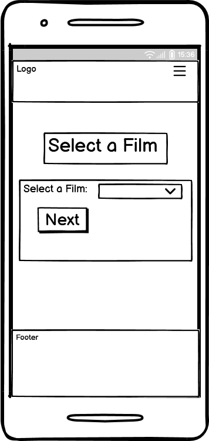
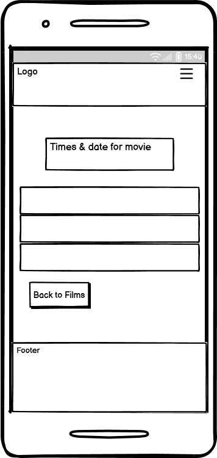
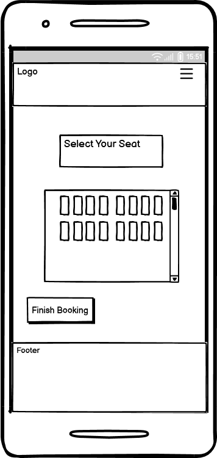
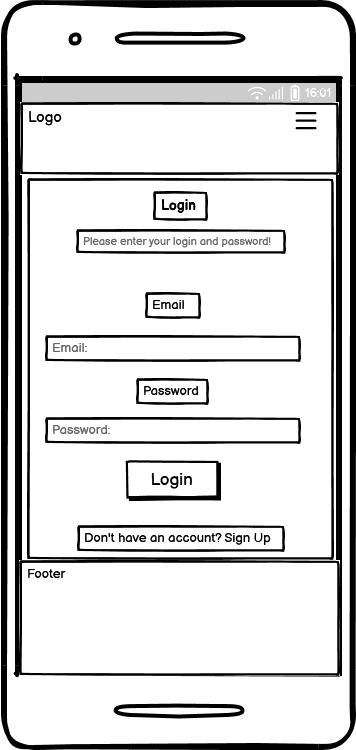
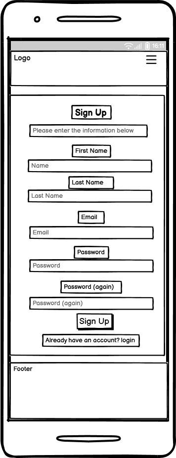
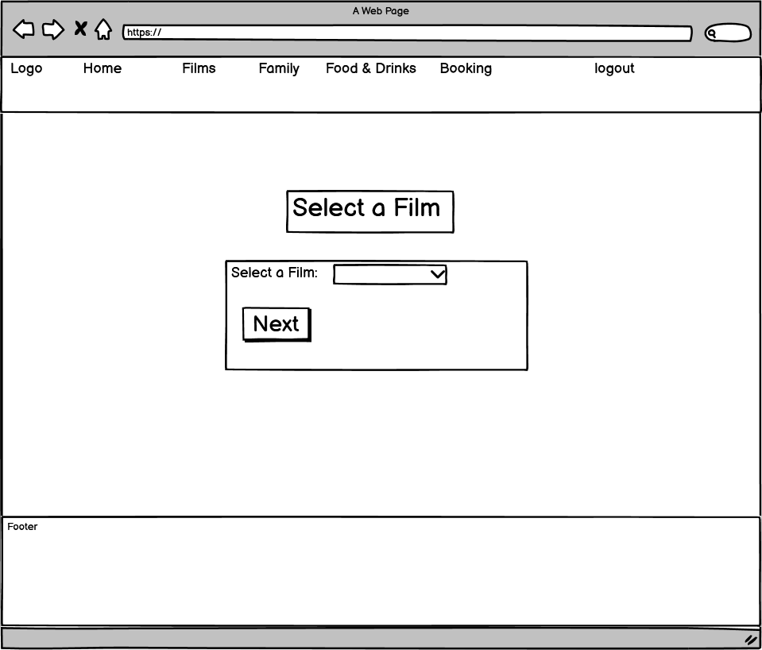
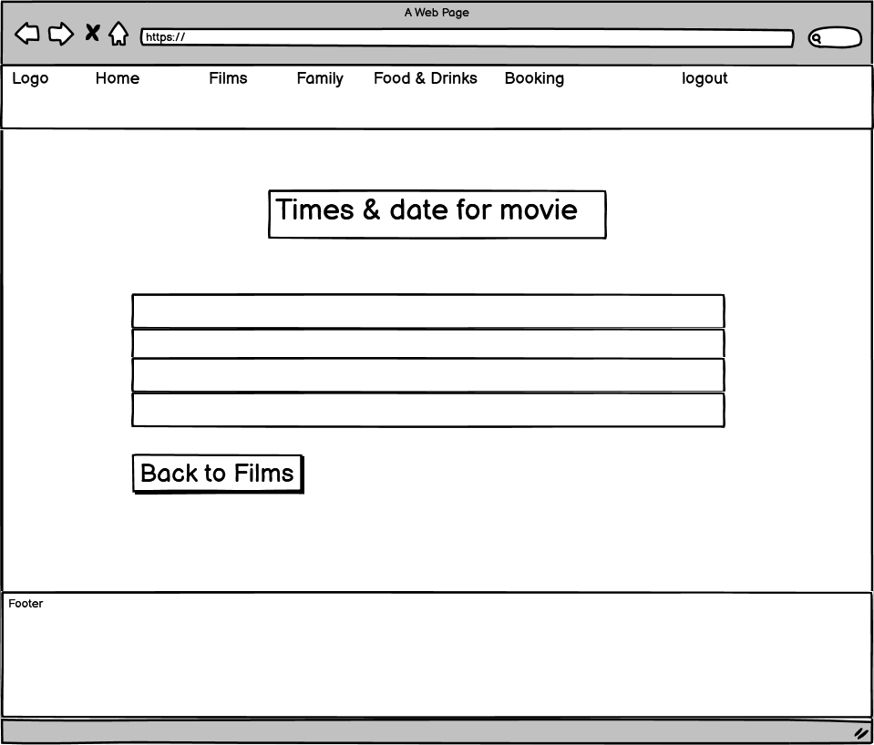
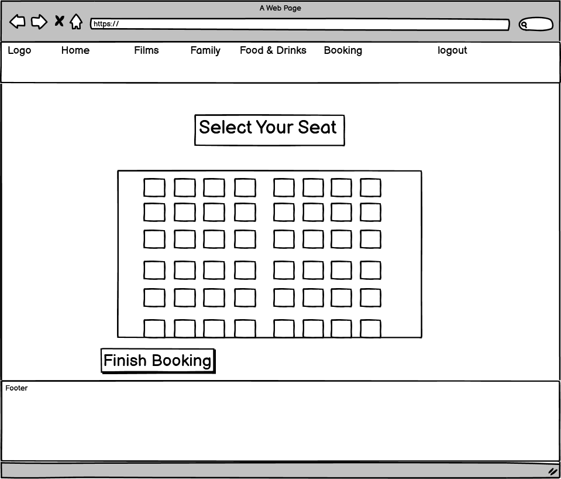
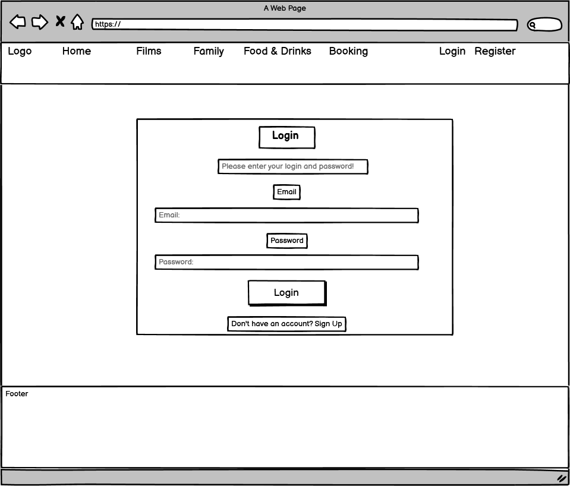
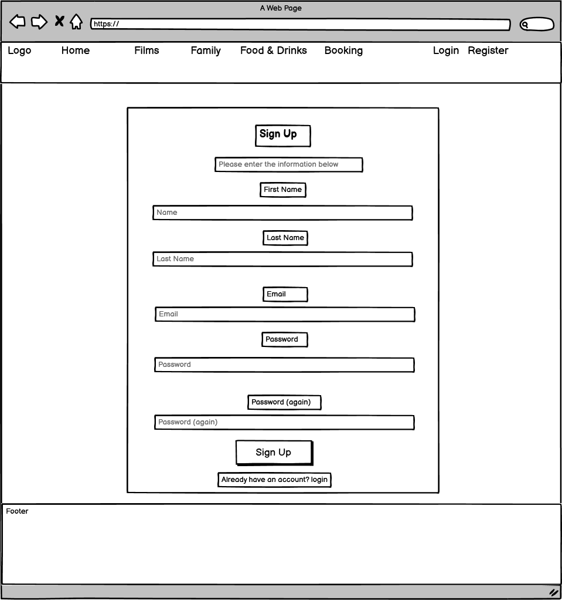

# MoviePortal

- - -
## Table of Contents

1. [Project Overview](#project-overview)
2. [Project Planning Method](#project-planning-method)
3. [UX](#ux)
    - [Strategy](#strategy)
    - [Scope](#scope)
    - [Structure](#structure)
    - [Skeleton](#skeleton)
    - [Surface](#surface)
4. [Features](#features)
5. [Data Model & Schema](#data-model--schema)
6. [Technologies Used](#technologies-used)
7. [Testing](#testing)
    - [Code Validation](#code-validation)
    - [Lighthouse Testing](#lighthouse-testing)
    - [Browser Compatibility](#browser-compatibility)
    - [Functional Testing](#functional-testing)
    - [User Story Testing](#user-story-testing)
    - [Bugs & Fixes](#bugs--fixes)
8. [Deployment](#deployment)
    - [Heroku](#heroku)
    - [Github](#github)
    - [Enviroment Setup](#enviroment-setup)
9. [Security Features](#security-features)
10. [Credits](#credits)

---

## Project Overview

**MoviePortal** is a cinema booking platform that allows users to **explore films**, **view schedules**, **select seats**, **browse food items** and **book tickets** to watch films in the cinema. It was developed to provide **convenience**, **accessibility** and an **immersive experience** for cinema-goers across all devices.

The website also provides **cinema managers** with efficient tools to manage **film listings**, **schedules** and **bookings**.

---

## Project planning method

This project was developed using an **Agile-inspired** workflow, with tasks prioritised using the **MoSCoW method**. This method allows me to categorise features into **Must-have**, **Should-have** and **Could-have**. Using the MoSCoW method for user stories ensures that I have prioritisation on core functionality for users.

I used **Github project board** to track my progress throughout the project. In the project board I have columns for **To Do**, **In Progress** and **Done**. This allowed me to monitor tasks I was doing easier.

The planning process was guided by user stories written for different types of users. The user type included **visitors**, **logged-in users** and **admin/managers**. Each user story is linked to a feature, implemented in code and tested to maintain usability and accessibility standards.

This method ensured the project stayed **focused**, **adaptable** and aligned with the needs of the target audience.

---

## UX

### Strategy

#### Project Purpose:

The project's purpose is to provide an **immersive** and **user-friendly** platform that allows users to **explore** and **discover films** with ease. The website enables users to **book cinema tickets online**, **select seats** and **choose a film** that is currently available. The website is designed to deliver the user a smooth experience across all devices and enhance **accessibility** for cinema-goers.

#### User Goals:

#### Admin/Manager Goals:

#### Site Owner Goals

The site owner goals would be to **increase ticket sales**, **improve customer experience** by offering a seamless, **user friendly interface**, and **promote films** by showing new releases and upcoming films.

#### Target Audience

The target audience would be for **casual and frequent moviegoers** of all different age groups, particularly **families and young adults**. The platform also works for **mobile users,** considering how many people have mobiles compared more than computers, making mobile users more likely to visit the site.

#### User Stories

**Vistors:**

**Logged-in User:**

**Admin/Manager:**

#### Research

For this project, I researched popular cinema websites such as **Vue, Odeon and Cineworld**. When looking at these websites, I noticed a common trend in which all of the websites had a landing page with **hero carousel images**. They would include **current movies showing in cinemas** which would seem to grab a user's attention. It would benefit my website to have a **carousel hero images** on my landing page, as it will show the user what the website is about. Most of the websites I visited had a **dark theme** to it to match the **cinematic tone**, which makes it immersive. From this I will be using more **dark tones** for this project.

**Websites Visited:**

[Vue](https://www.myvue.com/)

[Cineworld](https://www.cineworld.co.uk/#/)

[Odeon](https://www.odeon.co.uk/)

---

## Scope

The following features below are categorized by priority on what the users needs and development goals are.

### Must-Have Features

- User registration and login

- Film listing page

- Booking form with seat selection

- Admin/Manager panel to manage film listings

- Admin/Manager panel to view/manage bookings.

### Should-Have Features

- Logout feature

- Admin/Manager edit menu items

- Confirmation of booking

- User can update profile information

- User can view menu

- View upcoming movies

### Could-Have Features

- User can cancel booking

- User can filter movies by genre

---

## Structure

### Explain the structure

###  FlowCharts

---

## Skeleton

### Wireframes

#### Mobile

 

 Home 

 

 

 

  Films 

 

 

 

  Menu 

 

 

 

  Booking select film  

 

 

 

  Booking select schedule  

 

 

 

  Booking select seats  

 

 

 

  Login 

 

 

 

  Sign Up 

 

 

#### Desktop

 

 Home 

 

 

 

 Films 

 

 

 

 Menu 

 

 

 

  Booking select film  

 

 

 

  Booking select schedule  

 

 

 

  Booking select seats  

 

 

 

  Login 

 

 

 

  Sign Up 

 

 

---

## Surface

### Colours:

The website uses **dark colours**, primarily black to create an **immersive, cinematic atmosphere** that mirrors the experience of being inside a cinema. **Neon blue** is used as an accent colour to highlight **interactive elements**, helping them stand out clearly against the dark background. This not only enhances visual appeal but also guides the user by making it immediately obvious which elements are **clickable or interactive**.

  

### Fonts

I used **three types of fonts** for this website. All the fonts I used are imported from **Google Fonts**. I felt the fonts worked well for each other as they give a balance of **readability and contrast**.

- [Robot Condensed](https://fonts.google.com/specimen/Roboto+Condensed?query=Roboto) For the body text such as paragraphs
- [Barlow Condensed](https://fonts.google.com/specimen/Barlow+Condensed?query=Barlow+c) For headings 
- [Montserrat](https://fonts.google.com/specimen/Montserrat) For button text

---

## Features

### Home

#### Navbar

### Hero 

#### Menu page

#### Booking Page

#### Contact Page

map 
contact info

#### Login Page

#### Signup Page

### Admin Pages

Menu Page

Booking page edit/delete

### Footer

---

## Data Model & Schema

---

## Technologies Used

---

## Testing

### Code Validation

### Lighthouse Testing

### Browser Compatibility 

### Functional Testing

### User Story Testing

### Bugs & Fixes

 Procfile issue 
  

Fixed an issue where my Procfile was showing the wrong name.
This happened because I copied the Procfile from the Codestar project to this project.        

  

  CSS not showing up fix  

Fixed a bug that was not allowing me to see changes to my CSS.
I originally thought that bootstrap was the issue, but then realised my debug mode was on false.  

 Heroku not deploying fix 

 Issue with server 500 error; the server deployed on Heroku but didn't show up.
 I fixed this by adding the cloudinary to config var on the Heroku settings page.

 Hero carousel not moving on Firefox browser

Fixed issue with hero carousel not automatically moving on Firefox. I fixed this by adding a timer with  `data-bs-interval="7000"`, which
gives 7 seconds to move between each hero image. 

  

---

## Deployment

### Heroku

### Enviroment Setup

### Github

---

## Security Features

---

## Credits

