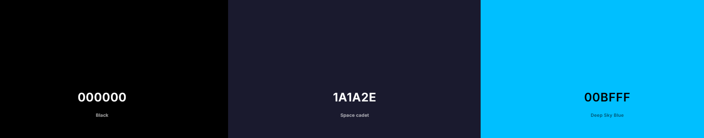
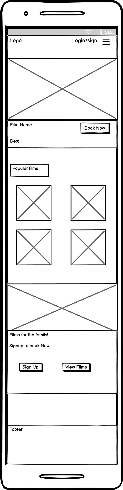

# [movie_portal](https://movieportal-f2737f46bcb0.herokuapp.com)

Developer: EllisBale ([EllisBale](https://www.github.com/EllisBale))

source: [movie_portal amiresponsive](https://ui.dev/amiresponsive?url=https://movieportal-f2737f46bcb0.herokuapp.com)

## Project Overview

**MoviePortal** is a cinema booking platform that allows users to **explore films**, **view schedules**, **select seats**, **browse food items** and **book tickets** to watch films in the cinema. It was developed to provide **convenience**, **accessibility** and an **immersive experience** for cinema-goers across all devices.

The website also provides **cinema managers** with efficient tools to manage **film listings**, **schedules** and **bookings**.

The target audience would be for **casual and frequent moviegoers** of all different age groups, particularly **families and young adults**. The platform also works for **mobile users,** considering how many people have mobiles compared more than computers, making mobile users more likely to visit the site.

I chose to develop an **online cinema booking system** because I wanted to create something **practical and useful**, a **real-world application** that people can use every day. **Cinema-going** is a popular recreational activity, yet many users face **inconveniences** when it comes to **booking tickets, selecting seats** and **viewing available films**. By developing this project, I aim to **enhance the cinema experience** and make it more **accessible, convenient and user-friendly** for a wide audience.

Another reason I chose this project is that it gave me a great opportunity to work on both **front-end and back-end development**. I get to build an **interactive, visually engaging interface** for users while also handling the **back-end logic** needed to **manage film listings, bookings and seat availability**. Working on both sides of the application helps me understand how a **web project fits together**, from designing **smooth, intuitive interfaces** to making sure everything works **reliably behind the scenes**.

For this project, I researched popular cinema websites such as **Vue, Odeon and Cineworld**. When looking at these websites, I noticed a common trend in which all of the websites had a landing page with **hero carousel images**. They would include **current movies showing in cinemas** which would seem to grab a user's attention. It would benefit my website to have a **carousel hero images** on my landing page, as it will show the user what the website is about. Most of the websites I visited had a **dark theme** to it to match the **cinematic tone**, which makes it immersive. From this I will be using more **dark tones** for this project.

**Websites Visited:**

[Vue](https://www.myvue.com/)

[Cineworld](https://www.cineworld.co.uk/#/)

[Odeon](https://www.odeon.co.uk/)

## UX 

### The 5 Planes of UX

#### 1. Strategy

**Purpose** 

The project's purpose is to provide an **immersive** and **user-friendly** platform that allows users to **explore** and **discover films** with ease. The website enables users to **book cinema tickets online**, **select seats** and **choose a film** that is currently available. The website is designed to deliver the user a smooth experience across all devices and enhance **accessibility** for cinema-goers.

**Admin/Managers Purpose**

This platform also provides an administrative interface that allows cinema managers to:

- **Create new films** and add details such as **title, genre, duration, showtimes, posters and etc.**
- **Update existing films** to modify **schedules and film details.**
- **Delete films** that **no longer are showing in cinemas.**

**Business Goals**

- **Increase ticket sales.**
- **Enhance the user experience** by providing a **seamless** and **user-friendly interface**.
- **Encourage repeat visits** by allowing users to **discover new films and book them easily**.
- **Promote new releases** and **upcoming films** to keep users informed.
- **Improve film** and **showtime management** for cinema staff to maintain an **up-to-date schedule**.

#### 2. Scope

The following features below are categorized by priority on what the users needs and development goals are.

 **Must-Have Features:**

- User registration and login

- Film listing page

- Booking form with seat selection

- Admin/Manager panel to manage film listings

- Admin/Manager panel to view/manage bookings.

 **Should-Have Features:**

- Logout feature

- Admin/Manager edit menu items

- Confirmation of booking

- User can update profile information

- User can view menu (food & drinks)

- View upcoming movies

**Could-Have Features:**

- User can cancel booking

- User can filter movies by genre

**Content Requirements**

- **Film Management** - **Admin/Manager** can **create**, **update** and **delete films**.
- **Booking Management** - **Admin/Manager** can **view/manage bookings**; **users** can **select seats and complete bookings**.
- **User Account Features** - **Register, login/logout, update profile** and **view bookings**.
- **Booking confirmation** - **User** gets **notified** when a **booking is confirmed**.
- **Error Handling** - **404 page** for lost users.

#### 3. Structure

**Information Architecture**

**Navigation Menu**:

**User (Guests)**
- Links to Home, Films, Family, Food & Drink, login and register.

**Logged-in-user**
- Links to Home, Films, Family, Food & Drink, Booking and logout.

**Admin/Managers**

**User Flow**

1. Guest users browse films -> view film general information.
2. Gust users register for an account -> log in to access booking features.
3. Registered users select a film, choose schedule, choose seats and complete booking -> receive booking confirmation.
4. Admin/Managers create, update and manage film schedule, film information, film listings and seat availability.
5. Admin/Managers view and manage bookings -> ensure smooth cinema operations and user satisfaction. 

#### 4. Skeleton

**[Wireframes](#wireframes)** (see below)

#### 5. Surface

**Visual Design Elements**
- **[Colours](#colour-scheme)** (see below)
- **[Typography](#typography)** (see below)

### Colour Scheme

The website uses **dark colours**, primarily black to create an **immersive, cinematic atmosphere** that mirrors the experience of being inside a cinema. **Neon blue** is used as an accent colour to highlight **interactive elements**, helping them stand out clearly against the dark background. This not only enhances visual appeal but also guides the user by making it immediately obvious which elements are **clickable or interactive**.

I used [coolors.co](https://coolors.co/000000-1a1a2e-00bfff) to generate my colour palette.

- `#ffffff` Primary text.
- `#acb0b6` details heading text.
- `#00BFFF` accent colour for button borders, seat select and part of linear gradient of navbar.
- `#1a1a2e` Footer colour and part of linear gradient of the navbar.

### Typography

I used **three types of fonts** for this website. All the fonts I used are imported from **Google Fonts**. I felt the fonts worked well for each other as they give a balance of **readability and contrast**.

I have icons on my webite from [Font Awesome](https://fontawesome.com/). Icons can quickly communicate to the user without having to read a word. For example, I use icons in my footer for social media links and contact information, which makes the actions instantly recognisable. Having Font Awesome icons gives the site more of a professional and modern appearance.

- [Robot Condensed](https://fonts.google.com/specimen/Roboto+Condensed?query=Roboto) For the body text such as paragraphs.
- [Barlow Condensed](https://fonts.google.com/specimen/Barlow+Condensed?query=Barlow+c) For headings (h1 to h4). 
- [Montserrat](https://fonts.google.com/specimen/Montserrat) For every button text throughout the site.

## Wireframes

To follow best practice, wireframes were developed for mobile, tablet and desktop sizes.
I've used [Balsamiq](https://balsamiq.com/wireframes) to design my site wireframes.

| Page | Mobile | Tablet | Desktop |
| --- | --- | --- | --- |
| Home |  |  |  |
| Films |  |  |  |
| Family |  |  |  |
| Food & Drink |  |  |  |
| Booking |  |  |  |
| Register |  |  |  |
| Login |  |  |  |
| Films.detail |  |  |  |
| Booking.schedule |  |  |  |
| Booking.seats |  |  |  |
| Booking.select_film |  |  |  |

## Project planning method

This project was developed using an **Agile-inspired** workflow, with tasks prioritised using the **MoSCoW method**. This method allows me to categorise features into **Must-have**, **Should-have** and **Could-have**. Using the MoSCoW method for user stories ensures that I have prioritisation on core functionality for users.

I used **Github project board** to track my progress throughout the project. In the project board I have columns for **To Do**, **In Progress** and **Done**. This allowed me to monitor tasks I was doing easier.

The planning process was guided by user stories written for different types of users. The user type included **visitors**, **logged-in users** and **admin/managers**. Each user story is linked to a feature, implemented in code and tested to maintain usability and accessibility standards.

This method ensured the project stayed **focused**, **adaptable** and aligned with the needs of the target audience.

---

## Features

### Home

#### Navbar

### Hero 

#### Menu page

#### Booking Page

#### Contact Page

map 
contact info

#### Login Page

#### Signup Page

### Admin Pages

Menu Page

Booking page edit/delete

### Footer

---

## Data Model & Schema

---

## Technologies Used

### Languages

- [HTML:](https://en.wikipedia.org/wiki/HTML) Used to build website structure of the website
- [CSS:](https://en.wikipedia.org/wiki/CSS#:~:text=Cascading%20Style%20Sheets%20(CSS)%20is,Web%2C%20alongside%20HTML%20and%20JavaScript.) Used to style website elements
- [JavaScript:](https://en.wikipedia.org/wiki/JavaScript) Used for front end interactive features
- [Python:](https://www.python.org/) Used to build the backend of this project within Django framework

### Frontend Frameworks & Libraries

- [Boostrap:](https://getbootstrap.com/) Used for styling and for layout
- [FontAwesome:](https://fontawesome.com/) Used to add icons to improve UX

### Backend Modoules / Packages & Frameworks

- [Django:](https://www.djangoproject.com/) Python-based web framework.
- [AllAuth:](https://docs.allauth.org/en/latest/) Intergrated Django authentication used for login and signup.
- [Django-crispy-forms:](https://django-crispy-forms.readthedocs.io/en/latest/) Simplifies styling and rendering of forms.
- [asgiref:](https://pypi.org/project/asgiref/) Provides support for ASGI.
- [certifi:](https://pypi.org/project/certifi/) Provides Mozilla's CA Bundle.
- [charset-normalizer:](https://pypi.org/project/charset-normalizer/) Used to detect character encoding of text data.
- [Cloudinary:](https://cloudinary.com/) Used for uploading and managing images through a cloud based management system.
- [dj-database-url:](https://pypi.org/project/dj-database-url/) Utility used to parse a database URL and convert it into Django's DATABASES settings.
- [Django-cloudinary-storage:](https://pypi.org/project/django-cloudinary-storage/) Package that intergrates Cloudinary storage with Django.
- [gunicorn:](https://gunicorn.org/) Used to serve Django applications in production enviroments.
- [idna:](https://pypi.org/project/idna/) A library that implements the IDN standard.
- [psycopg2-binary:](https://pypi.org/project/psycopg2-binary/) Used by Django to interact with PostgreSQL databases.
- [requests:](https://pypi.org/project/requests/) Python HTTP library used for making requests to a web server.
- [setuptools:](https://pypi.org/project/setuptools/) Used to create Python packages and manage dependencies.
- [six:](https://pypi.org/project/six/) Provides utility functions that help write code for both Python 2 and 3.
- [sqlparse:](https://pypi.org/project/sqlparse/) Used for parsing SQL queries.
- [tzdata:](https://pypi.org/project/tzdata/) Handles timezone-related data.
- [urllib3:](https://pypi.org/project/urllib3/) HTTP client that is used by requests and other libraries.
- [whitenoise:](https://whitenoise.readthedocs.io/en/stable/django.html) Used to serve static files in Django for production.

### Databases

- [PostgreSQL:](https://www.postgresql.org/) Open-source relational database system. 
- [Neon:](https://neon.com/) A serverless cloud-native PostgreSQL database.

### Other Tools

- [Git:](https://git-scm.com/) Used for version control
- [Github:](https://github.com/) Used to store the projects code
- [VSCode:](https://code.visualstudio.com/) Code editor used for writing, editing and debugging code
- [Heroku:](https://www.heroku.com/) Used to deploy the live website
- [Google Chrome Dev Tools:](https://developer.chrome.com/docs/devtools) Used for inspecting HTML, CSS and JavaScript and performance of web pages

### External Sites

- [Balsamiq wireframes:](https://balsamiq.com/) Used to create the wireframes for the websites layout and structure
- [Google Fonts:](https://fonts.google.com/) Used to import fonts for my project
- [Pixabay:](https://pixabay.com/) Used for downloading copyright free images to use for my website
- [capitalizemytitle:](https://capitalizemytitle.com/) Used for creating the description of movies in this project
- [name-generator:](https://www.name-generator.org.uk/) Used for generating the names for the cast in the films.
- [TempMail:](https://temp-mail.org/) Used for creating temporary emails for testing account signup/login.

---

## Testing

### Code Validation

### Lighthouse Testing

### Browser Compatibility 

### Functional Testing

### User Story Testing

### Bugs & Fixes

 Procfile issue 
  

Fixed an issue where my Procfile was showing the wrong name.
This happened because I copied the Procfile from the Codestar project to this project.        

  

  CSS not showing up fix  

Fixed a bug that was not allowing me to see changes to my CSS.
I originally thought that bootstrap was the issue, but then realised my debug mode was on false.  

 Heroku not deploying fix 

 Issue with server 500 error; the server deployed on Heroku but didn't show up.
 I fixed this by adding the cloudinary to config var on the Heroku settings page.

 Hero carousel not moving on Firefox browser

Fixed issue with hero carousel not automatically moving on Firefox. I fixed this by adding a timer with  `data-bs-interval="7000"`, which
gives 7 seconds to move between each hero image. 

  

 Hero carousel not moving when mouse hovers over

Fixed an issue in which `data-bs-touch="true"` was being activated even if the user wasn't hovering over the carousel. This happened because of the height of the `.carousel-inner` class, which was overlapping.

Before, my code was:
`.carousel-inner { height: 85vh !important; }`

The height was set to a fixed value, so I changed it to:
`.carousel-inner, .carousel-item { height: auto; }`

I also added padding to:
`.carousel-item .container { padding-top: 1rem; padding-bottom: 2rem; }`

  

---

## Deployment

### Heroku

### Enviroment Setup

### Github

---

## Security Features

---

## Credits

### Images

 Menu Images Used:

- [Juices](https://pixabay.com/illustrations/ai-generated-drink-juice-8527256/) By myshoun
- [Chocolate](https://pixabay.com/illustrations/chocolate-flavor-cocoa-close-up-8919274/) By u_he12qucmwq
- [Ice Cream](https://pixabay.com/illustrations/ai-generated-ice-cream-food-8867435/) By Manik
- [Candy](https://pixabay.com/illustrations/sweets-chocolate-candy-lollipop-7705343/)
- [Hotdog](https://pixabay.com/illustrations/hot-dog-food-sandwich-bread-fries-7605754/) By Hansuan_Fabregas
- [Popcorn](https://pixabay.com/illustrations/food-snack-popcorn-container-7908758/) By Secoura
- [Soft Drinks](https://pixabay.com/illustrations/ai-generated-soda-drink-cola-coke-8947090/) By rosiproductorseguros
- [Coffee Drink](https://pixabay.com/illustrations/disposable-coffee-drink-water-8748932/) By Claudio-Duart-Designer

Film Images Used:

- 
- 
- 

