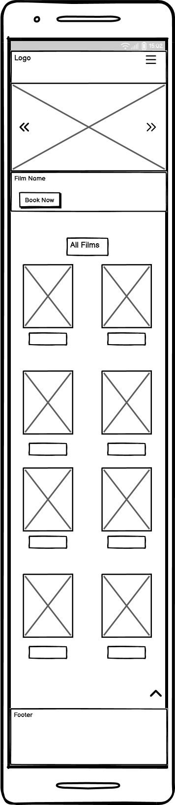
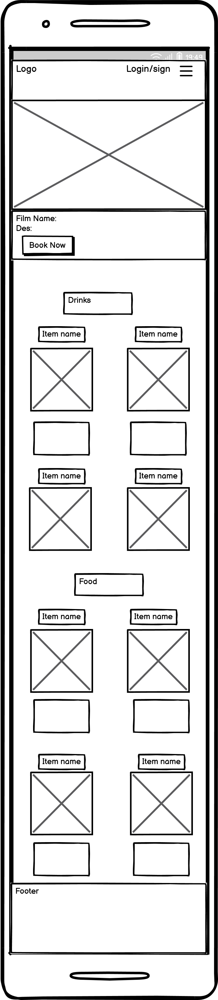
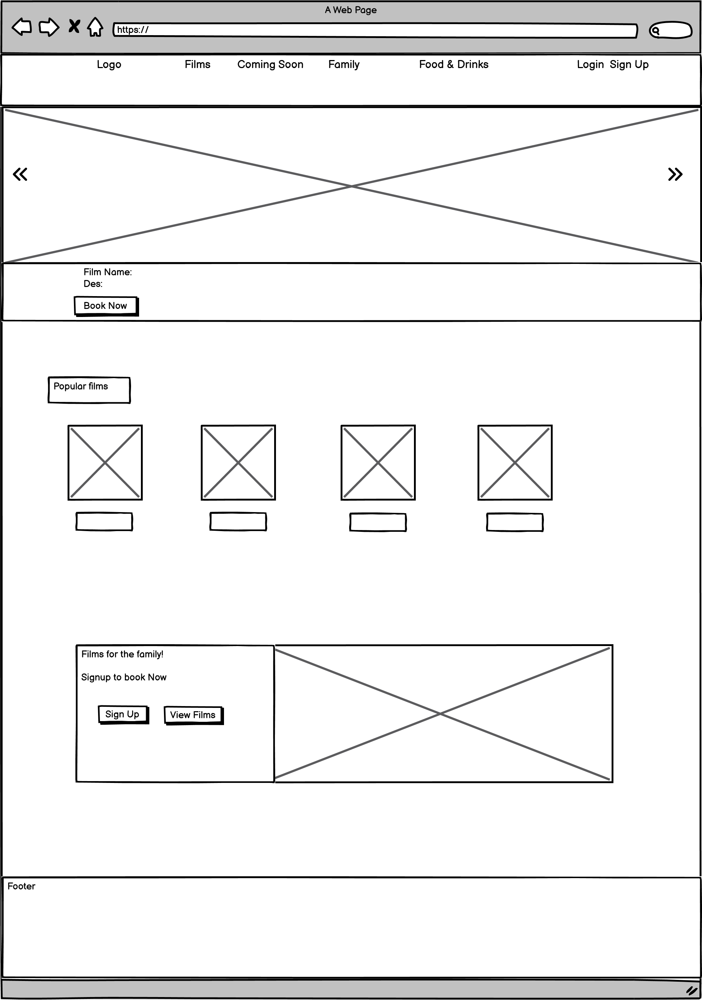
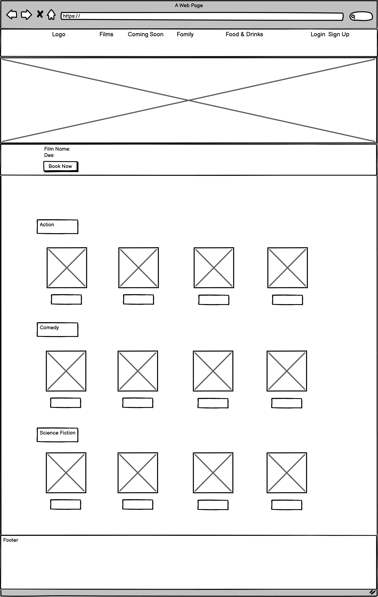
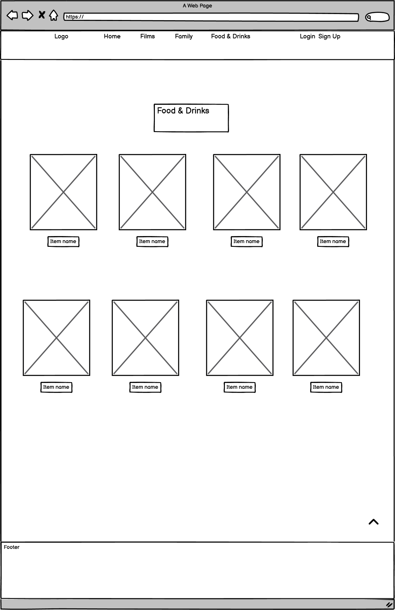
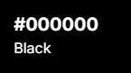
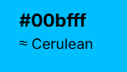

# MoviePortal

1. [UX](#ux)
    - [Strategy](#strategy)
        - [Project Purpose](#project-purpose)
    - [Scope](#scope)
    - [Structure](#structure)
    - [Skeleton](#skeleton)
    - [Surface](#surface)

2. [Features](#features)

3. [Technologies Used](#technologies-used)

4. [Testing](#testing)
    - [Code Validation](#code-validation)
    - [Lighthouse Testing](#lighthouse-testing)
    - [Browser Compatibility](#browser-compatibility)
    - [Functional Testing](#functional-testing)
    - [User Story Testing](#user-story-testing)

5. [Deployment](#deployment)
    - [Heroku](#heroku)
    - [Github](#github)

6. [Credits](#credits)

## **UX**

### Strategy

#### Project Purpose:

The projects purpose is to provide an immersive and user-friendly platform that allows users to explore and discover films with ease. The website enables users to book cinema tickets online, select seats and choose a film that is currently available. The website is designed to deliver the user a smooth experience across all devices and enhance accessibilty for cinema-goers.

#### User Goals:

#### Admin/Manager Goals:

#### Site Owner Goals

The site owner goals would be to increase ticket sales, improve customer experience by offering a seamless, user friendly interface, and promote films by showing new releases and upcoming films.

#### Target Audience

The target audience would be for casual and frequent moviegoers of all different age groups, particularly families and young adults. The platform also works for mobile users because of how many people have mobiles compared to computers making mobile users more likely to visit the site.

#### Research

For this project, I looked at popular cinema websites such as Vue, Odeon and Cineworld. When looking at these websites I noticed a common trend in which all of the websites had a landing page with hero carousel images. They would include current movies showing in cinemas which would seem to grab a user's attention. It would benefit my website to have a carousel hero images on my landing page as it will show the user what the website is about. Most of the websites I visited had a dark theme to it to match the cinematic tone which makes it immersive. From this I will be using more dark tones for this project.

**Websites visited:**

[Vue](https://www.myvue.com/)

[Cineworld](https://www.cineworld.co.uk/#/)

[Odeon](https://www.odeon.co.uk/)

## Scope

## **Structure**

### Explain the structure

###  FlowCharts

## **Skeleton**

 

### Wireframes

#### Mobile

 

 Home 

 

 

 

  Films 

 

 

 

  Menu 

 

 

#### Desktop

 

 Home 

 

 

 

 Films 

 

 

 

 Menu 

 

 

Schema 

Schema chart

## **Surface**

### Colours:

The website uses dark colours, primarily black to create an immersive, cinematic atmosphere that mirrors the experience of being inside a cinema. Neon blue is used as an accent colour to highlight interactive elements, helping them stand out clearly against the dark background. This not only enhances visual appeal but also guides the user by making it immediately obvious which elements are clickable or interactive.

  

### Fonts

I used three types of fonts for this website. All the fonts I used are imported from googlefonts. I felt the fonts worked well for eachother as they give a balance of readability and contrast.

- [Robot Condensed](https://fonts.google.com/specimen/Roboto+Condensed?query=Roboto) For the body text such as paragraphs
- [Barlow Condensed](https://fonts.google.com/specimen/Barlow+Condensed?query=Barlow+c) For headings 
- [Montserrat](https://fonts.google.com/specimen/Montserrat) For button text

### Visuals

## **Project planning method**

 

## **Features**

### Home

#### Navbar

### Hero 

#### Menu page

#### Booking Page

#### Contact Page

map 
contact info

#### Login Page

#### Signup Page

### Admin Pages

Menu Page

Booking page edit/delete

### Footer

## Technologies Used

## Testing

### Code Validation

### Lighthouse Testing

### Browser Compatibility 

### Bugs & Fixes

### Functional Testing

### User Story Testing

## Deployment

## Credits

