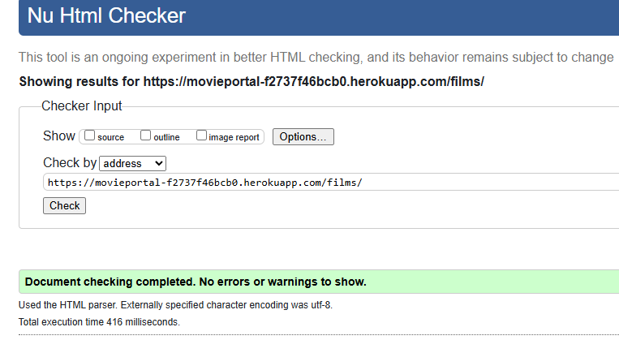
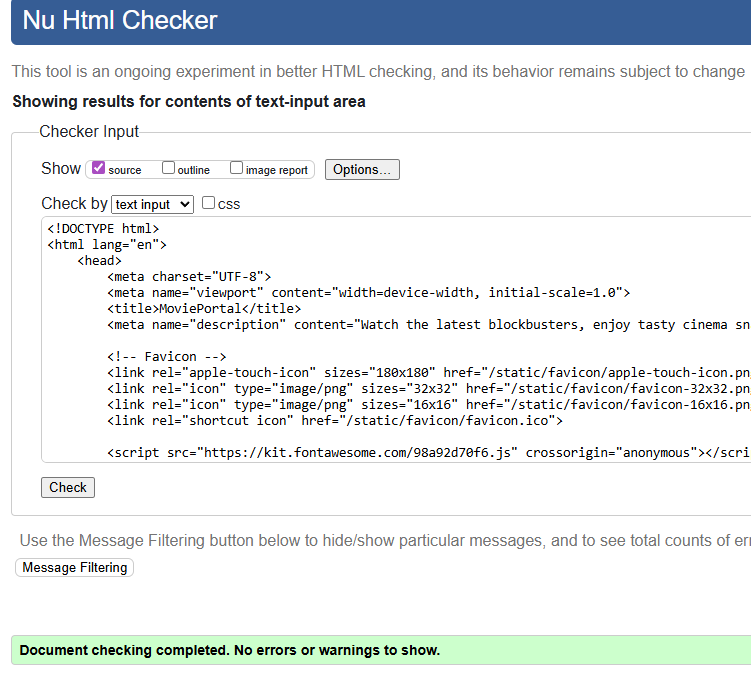
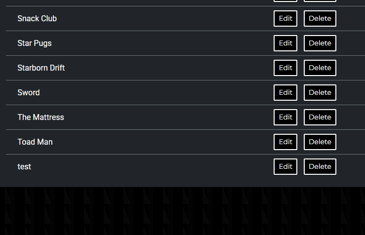

# Testing

> [!NOTE]  
> Return back to the [README.md](README.md) file.

## Code Validation

### HTML

I have used the recommended [HTML W3C Validator](https://validator.w3.org) to validate all of my HTML files.

| Directory | File | URL | Screenshot | Notes |
| --- | --- | --- | --- | --- |
| bookings | [book_seats.html](https://github.com/EllisBale/movie_portal/blob/main/bookings/templates/book_seats.html) | ⚠️ Need to login [Link](https://movieportal-f2737f46bcb0.herokuapp.com/bookings/38/) |  | No Errors |
| bookings | [bookings_success.html](https://github.com/EllisBale/movie_portal/blob/main/bookings/templates/bookings_success.html) | ⚠️ Need to login [Link](https://movieportal-f2737f46bcb0.herokuapp.com/bookings/success/) |  | No Errors |
| bookings | [select_film.html](https://github.com/EllisBale/movie_portal/blob/main/bookings/templates/select_film.html) | ⚠️ Need to login [Link](https://movieportal-f2737f46bcb0.herokuapp.com/bookings/select-film/) |  | No Errors |
| bookings | [select_schedule.html](https://github.com/EllisBale/movie_portal/blob/main/bookings/templates/select_schedule.html) | ⚠️ Need to login [Link](https://movieportal-f2737f46bcb0.herokuapp.com/films/schedules/21/) |  | No Errors |
| bookings | [user_booking.html](https://github.com/EllisBale/movie_portal/blob/main/bookings/templates/user_booking.html) | ⚠️ Need to login [Link](https://movieportal-f2737f46bcb0.herokuapp.com/bookings/my_bookings/) |  | No Errors |
| films | [films.html](https://github.com/EllisBale/movie_portal/blob/main/films/templates/films.html) |  [Link](https://movieportal-f2737f46bcb0.herokuapp.com/films/) |  | No Errors |
| films | [films_detail.html](https://github.com/EllisBale/movie_portal/blob/main/films/templates/films_detail.html) |  [Link](https://movieportal-f2737f46bcb0.herokuapp.com/films/2/) |  | No Errors |
| home | [family.html](https://github.com/EllisBale/movie_portal/blob/main/home/templates/family.html) |  [Link](https://movieportal-f2737f46bcb0.herokuapp.com/family/) |  | No Errors |
| home | [index.html](https://github.com/EllisBale/movie_portal/blob/main/home/templates/home/index.html) |  [Link](https://movieportal-f2737f46bcb0.herokuapp.com/home/) |  | No Errors |
| management | [booking_update.html](https://github.com/EllisBale/movie_portal/blob/main/management/templates/management/booking_update.html) | ⚠️ Not applicable  |  | No Errors |
| management | [bookings_list.html](https://github.com/EllisBale/movie_portal/blob/main/management/templates/management/bookings_list.html) | ⚠️ Not applicable  |  | No Errors |
| management | [film_form.html](https://github.com/EllisBale/movie_portal/blob/main/management/templates/management/film_form.html) | ⚠️ Not applicable |  | No Errors |
| management | [films_list.html](https://github.com/EllisBale/movie_portal/blob/main/management/templates/management/films_list.html) | ⚠️ Not applicable |  | No Errors |
| management | [schedule_form.html](https://github.com/EllisBale/movie_portal/blob/main/management/templates/management/schedule_form.html) | ⚠️ Not applicable |  | No Errors |
| management | [schedule_list.html](https://github.com/EllisBale/movie_portal/blob/main/management/templates/management/schedule_list.html) | ⚠️ Not applicable |  | No Errors |
| management | [user_form.html](https://github.com/EllisBale/movie_portal/blob/main/management/templates/management/user_form.html) | ⚠️ Not applicable |  | No Errors |
| management | [user_list.html](https://github.com/EllisBale/movie_portal/blob/main/management/templates/management/user_list.html) | ⚠️ Not applicable |  | No Errors |
| menu | [menu.html](https://github.com/EllisBale/movie_portal/blob/main/menu/templates/menu.html) |  [Link](https://movieportal-f2737f46bcb0.herokuapp.com/menu/) |  | No Errors |
| templates | [404.html](https://github.com/EllisBale/movie_portal/blob/main/templates/404.html) |  [Link](https://movieportal-f2737f46bcb0.herokuapp.com/404) |  | No Errors |
| user_account | [login.html](https://github.com/EllisBale/movie_portal/blob/main/user_account/templates/account/login.html) |  [Link](https://movieportal-f2737f46bcb0.herokuapp.com/accounts/login/) |  | No Errors |
| user_account | [logout.html](https://github.com/EllisBale/movie_portal/blob/main/user_account/templates/account/logout.html) |  [Link](https://movieportal-f2737f46bcb0.herokuapp.com/accounts/logout/) |  | No Errors |
| user_account | [password_reset.html](https://github.com/EllisBale/movie_portal/blob/main/user_account/templates/account/password_reset.html) | [Link](https://movieportal-f2737f46bcb0.herokuapp.com/accounts/password/reset/)   |  | No Errors |
| user_account | [password_reset_done.html](https://github.com/EllisBale/movie_portal/blob/main/user_account/templates/account/password_reset_done.html) |  [Link](https://movieportal-f2737f46bcb0.herokuapp.com/accounts/password/reset/done/) |  | No Errors |
| user_account | [signup.html](https://github.com/EllisBale/movie_portal/blob/main/user_account/templates/account/signup.html) |  [Link](https://movieportal-f2737f46bcb0.herokuapp.com/accounts/signup/) |  | No Errors |

### CSS

I have used the recommended [CSS Jigsaw Validator](https://jigsaw.w3.org/css-validator) to validate all of my CSS files.

| Directory | File | URL | Screenshot | Notes |
| --- | --- | --- | --- | --- |
| static | [style.css](https://github.com/EllisBale/movie_portal/blob/main/static/css/style.css) |  [Link](https://movieportal-f2737f46bcb0.herokuapp.com/static/css/style.css) |  | There was no errors but there were 8 warnings. I didn't need to fix this because most of the warnings are coming from vendor extension and CSS variables not being statically checked.  |

### JavaScript

I have used the recommended [JShint Validator](https://jshint.com) to validate all of my JS files.

| Directory | File | URL | Screenshot | Notes |
| --- | --- | --- | --- | --- |
| static | [script.js](https://github.com/EllisBale/movie_portal/blob/main/static/js/script.js) | [Link](https://movieportal-f2737f46bcb0.herokuapp.com/static/js/script.js)  |  | Delted an unused variable which I deleted. When using JShint, I needed to add `/* jshint esversion: 11 */` to the top of the file to allow ES11 syntax. |

## Browser Compatibility

I've tested my deployed project on multiple browsers to check for compatibility issues.

| Page | Chrome | Firefox | Safari | Notes |
| --- | --- | --- | --- | --- |
| Register |  |  |  | Works as expected |
| Login |  |  |  | Works as expected |
| Home |  |  |  | Works as expected |
| Add Blog |  |  |  | Works as expected |
| Edit Blog |  |  |  | Works as expected |
| Blog Post |  |  |  | Works as expected |
| 404 |  |  |  | Works as expected |

## Lighthouse Audit

I've tested my deployed project using the Lighthouse Audit tool to check for any major issues. Some warnings are outside of my control, and mobile results tend to be lower than desktop.

| Page | Mobile | Desktop |
| --- | --- | --- |
| Register |  |  |
| Login |  |  |
| Home |  |  |
| Add Blog |  |  |
| Edit Blog |  |  |
| Blog Post |  |  |
| 404 |  |  |

## Defensive Programming

Defensive programming was manually tested with the below user acceptance testing:

| Page | Expectation | Test | Result | Screenshot |
| --- | --- | --- | --- | --- |
| Film Management | Feature is expected to allow admin/staff to add new films with title, poster, description, and cast. | Create a new film film with valid details and poster image.  | Film was added successfully and displayed in films list. |  |
| | Feature is expected to allow admin/staff to be able to edit existing film details.| Update film's title and description.| Changes appeared correctly on the films page and details page.  |  |
| | Feature is expected to allow admin/staff to be able to delete films. | Delete a film from the film list. | Film was removed successfully. |  |
| Schedule Management| Feature is expected to allow admin/staff to be able to create film schedules (date, time & film) | Add film schedule to a film. | Schedule was added. |  |
| | Feature is expected to allow admin/staff to be able to delete schedules. | Delete an existing schedule. | Schedule was removed successfully. |  |
| Booking Management| Feature is expected to allow admin/staff to be able to view all bookings. | Checked the bookings list as staff. | All bookings were displayed with user, film, time and seat details. |  |
| | Feature is expected to allow admin/staff to be able to edit bookings (change film schedule, seat and user). | Updated a booking seat. | Booking was updated successfully. |  |
| | Feature is expected to allow admin/staff to be able to delete bookings. | Delete a booking from the list. | Booking was deleted successfully. |  |
| User Management | Feature is expected to allow admin/staff to view all users. | Accessed the user list page. | All registered users were displayed. |  |
| | Feature is expected to allow admin/staff to be able to delete users. | Deleted a test user account. | User was deleted successfully. |  |
| Authentication | Users should be able to register an account. | Go to register page and make an account. | Registration was successful and user was logged in. |  |
| | Feature is expected to allow users to log in securely. | Logged in with valid credentials. | Login was successful. |  |
| | Feature is expected to allow users to be able to logout securely. | Logged out after login and tried to access booking page. | Access was denied as expected. |  |
| Booking as User | Feature is expected to allow users to select a film to book. | Logged in user goes to booking and selects film to move onto next page. | User can choose film to book as expected and move onto next page of booking.  |  |
| |  Feature is expected to allow users to select a schedule that is available for that movie. | Logged in users goes and selects a schedule that is available for the chosen film. | User can select a schedule and moves onto the select seats page.|  |
| |  Feature is expected to allow users to select a seat/seats to finish booking. | Logged in users goes and selects a seat/seats to finish booking. | User can select seats successfully to finish booking.|  |
| Guest Access | Guests should be able to view film information but not book. | Tried booking as a guest and clicking on book button. | User can view film information but not be able to book without logging in. |  |
|  Manage booking as User | Feature is expected to allow logged in users to view there bookings on a seperate page. | Log in as a user and make a booking then view your booking information on the "My Bookings" link on the navbar. When page has loaded, bookings should be visible. | User can view bookings they have made when logged in on the my_bookings page. |  |
| |  Feature is expected to allow logged in users to delete/cancel bookings they have made. | Logged in users goes and clicks delete button on their booking to remove it from page. | Logged in user can successfully delete their bookings by clicking on delete button. |  |
| Security | Unauthorized users should not access admin pages. | Tried to access the URL as a guest & non-admin user. | Non-admin users can't access admin pages through URL links.  |  |
| 404 Error Page | Feature is expected to display a 404 error page for non-existent pages with a "Go Back Home" link. | Navigated to an invalid URL (e.g., `/test`). | A custom 404 error page was displayed as expected.  |  |
| Promotional (call-to-action) section| Feature is expected to display the "Films For The Family" section for users that are not logged in. Users have a link to sign up and view films. | Navigated to home page just above the footer there should be a section for "Films For The Family". Click "Sign Up" to see if it opens the `account/signup/` page. | Guest User can access this and click on sign up button which links them to the `account/signup/` page as well as view films as a guest.  |  |
| |  Feature is expected to change the family call-to-action section to a "Book A Film" section when a user is logged in. This links them to booking page and films page.| Logged in user goes to home page and scrolls to bottom just above footer. From there the section changes to promote booking for logged in users. | Logged in users successfully can see the "Book A Film" section which contains links to booking page and films.  |  |
| |  Feature is expected to link users to the menu page with the menu section on family page. | Any User can view the menu section that links user to Menu page when user clicks on "View Menu" button.  |  All users can view the menu section on the family page and link to the Menu page successfully.   |  |

## User Story Testing

| Target | Expectation | Outcome | Screenshot |
| --- | --- | --- | --- |
| As a blog owner | I would like to create new blog posts with a title, featured image, and content | so that I can share my experiences with my audience. |  |
| As a blog owner | I would like to update existing blog posts | so that I can correct or add new information to my previous stories. |  |
| As a blog owner | I would like to delete blog posts | so that I can remove outdated or irrelevant content from my blog. |  |
| As a blog owner | I would like to retrieve a list of all my published blog posts | so that I can manage them from a central dashboard. |  |
| As a blog owner | I would like to preview a post as draft before publishing it | so that I can ensure formatting and content appear correctly. |  |
| As a blog owner | I would like to review comments before they are published | so that I can filter out spam or inappropriate content. |  |
| As a blog owner | I would like to approve or reject comments from users | so that I can maintain control over the discussion on my posts. |  |
| As a blog owner | I would like to view a list of all comments (both approved and pending) | so that I can manage user engagement effectively. |  |
| As a blog owner | I would like to edit or delete user comments | so that I can clean up or remove inappropriate responses after they've been posted. |  |
| As a registered user | I would like to log in to the site | so that I can leave comments on blog posts. |  |
| As a registered user | I would like to register for an account | so that I can become part of the community and engage with the blog. |  |
| As a registered user | I would like to leave a comment on a blog post | so that I can share my thoughts or ask questions about the owner's experiences. |  |
| As a registered user | I would like my comment to show my name and the timestamp | so that others can see who I am and when I left the comment. |  |
| As a registered user | I would like to receive a notification or message saying my comment is pending approval | so that I understand it hasn't been posted immediately. |  |
| As a registered user | I would like to edit or delete my own comments | so that I can fix mistakes or retract my statement. |  |
| As a guest user | I would like to read blog posts without registering | so that I can enjoy the content without needing to log in. |  |
| As a guest user | I would like to browse past posts | so that I can explore the blog's full content history. |  |
| As a guest user | I would like to register for an account | so that I can participate in the community by leaving comments on posts. |  |
| As a guest user | I would like to see the names of other commenters on posts | so that I can get a sense of community interaction before registering. |  |
| As a user | I would like to see a 404 error page if I get lost | so that it's obvious that I've stumbled upon a page that doesn't exist. |  |

## Automated Testing

I have conducted a series of automated tests on my application.

> [!NOTE]  
> I fully acknowledge and understand that, in a real-world scenario, an extensive set of additional tests would be more comprehensive.

### Python (Unit Testing)

I have used Django's built-in unit testing framework to test the application functionality. In order to run the tests, I ran the following command in the terminal each time:

- `python3 manage.py test name-of-app`

To create the coverage report, I would then run the following commands:

- `pip3 install coverage`
- `pip3 freeze --local > requirements.txt`
- `coverage run --omit="*/site-packages/*,*/migrations/*,*/__init__.py,env.py,.env" manage.py test`
- `coverage report`

To see the HTML version of the reports, and find out whether some pieces of code were missing, I ran the following commands:

- `coverage html`
- `python3 -m http.server`

Below are the results from the full coverage report on my application that I've tested:

#### Unit Test Issues

## Bugs

### Fixed Bugs

I've used [GitHub Issues](https://www.github.com/EllisBale/movie_portal/issues) to track and manage bugs and issues during the development stages of my project.

All previously closed/fixed bugs can be tracked [here](https://www.github.com/EllisBale/movie_portal/issues?q=is%3Aissue+is%3Aclosed+label%3Abug).

### Unfixed Bugs

Any remaining open issues can be tracked [here](https://www.github.com/EllisBale/movie_portal/issues?q=is%3Aissue+is%3Aopen+label%3Abug).

### Known Issues

| Issue | Screenshot |
| --- | --- |
| On devices smaller than 375px, the page starts to have horizontal `overflow-x` scrolling. |  |
| When validating HTML with a semantic `<section>` element, the validator warns about lacking a header `h2-h6`. This is acceptable. |  |
| Validation errors on "signup.html" coming from the Django Allauth package. |  |

> [!IMPORTANT]  
> There are no remaining bugs that I am aware of, though, even after thorough testing, I cannot rule out the possibility.

