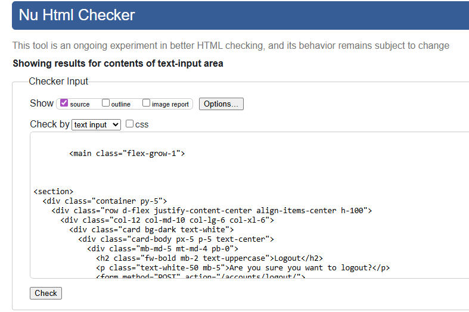
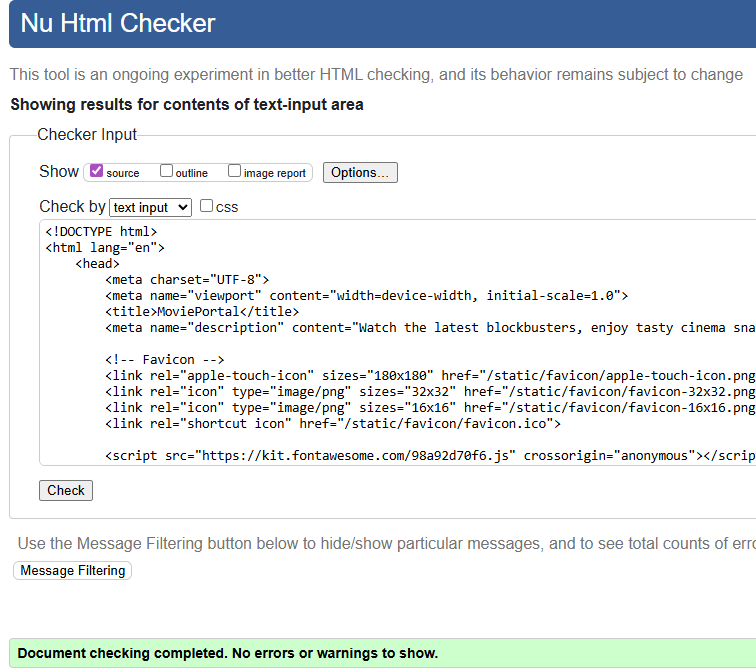
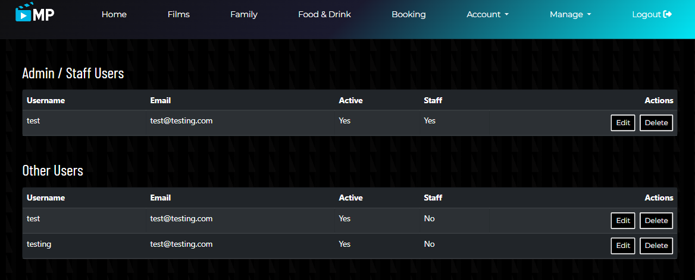
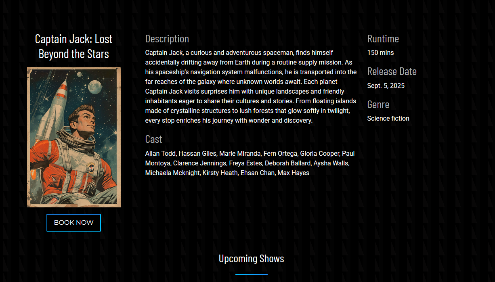
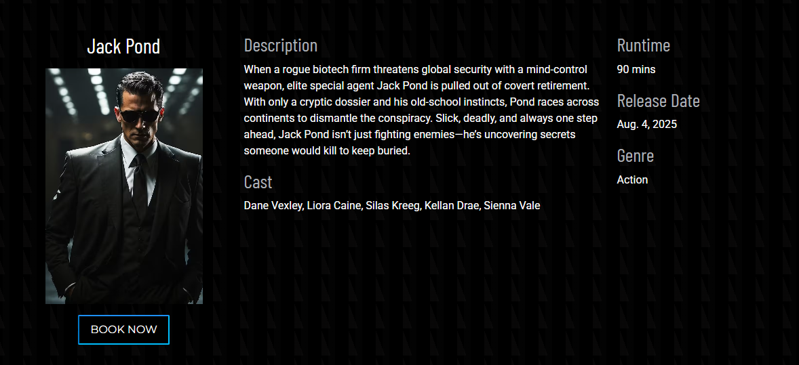
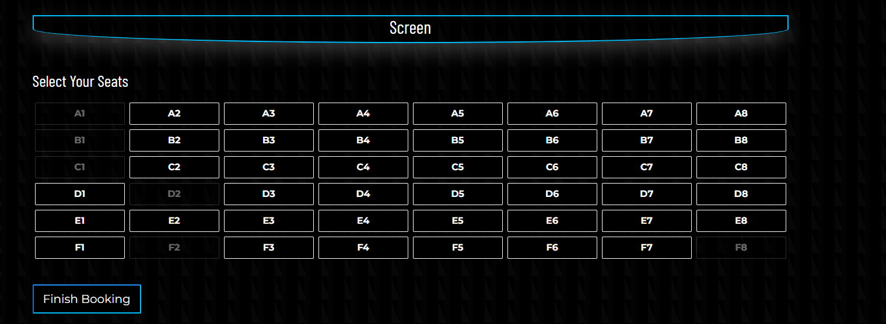
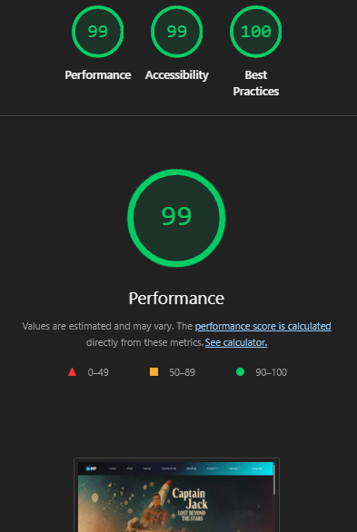
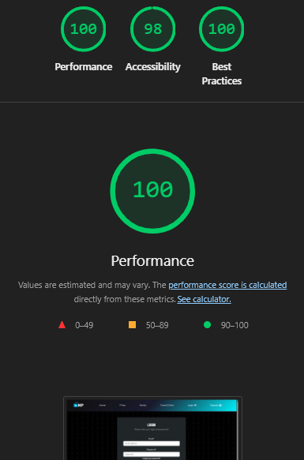
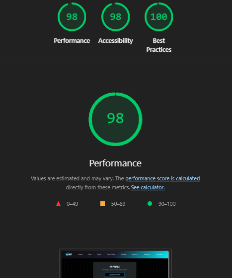
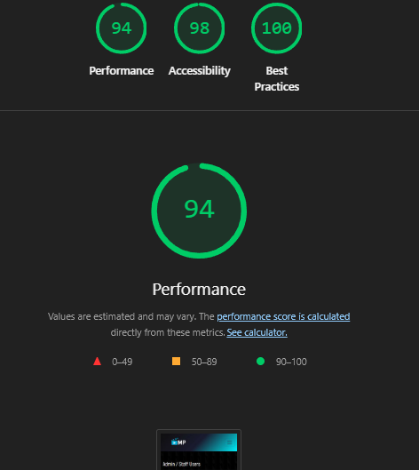

# Testing

> [!NOTE]  
> Return back to the [README.md](README.md) file.

## Code Validation

### HTML

I have used the recommended [HTML W3C Validator](https://validator.w3.org) to validate all of my HTML files.

| Directory | File | URL | Screenshot | Notes |
| --- | --- | --- | --- | --- |
| bookings | [book_seats.html](https://github.com/EllisBale/movie_portal/blob/main/bookings/templates/book_seats.html) | ⚠️ Need to login [Link](https://movieportal-f2737f46bcb0.herokuapp.com/bookings/38/) |  | No Errors |
| bookings | [bookings_success.html](https://github.com/EllisBale/movie_portal/blob/main/bookings/templates/bookings_success.html) | ⚠️ Need to login [Link](https://movieportal-f2737f46bcb0.herokuapp.com/bookings/success/) |  | No Errors |
| bookings | [select_film.html](https://github.com/EllisBale/movie_portal/blob/main/bookings/templates/select_film.html) | ⚠️ Need to login [Link](https://movieportal-f2737f46bcb0.herokuapp.com/bookings/select-film/) |  | No Errors |
| bookings | [select_schedule.html](https://github.com/EllisBale/movie_portal/blob/main/bookings/templates/select_schedule.html) | ⚠️ Need to login [Link](https://movieportal-f2737f46bcb0.herokuapp.com/films/schedules/21/) |  | No Errors |
| bookings | [user_booking.html](https://github.com/EllisBale/movie_portal/blob/main/bookings/templates/user_booking.html) | ⚠️ Need to login [Link](https://movieportal-f2737f46bcb0.herokuapp.com/bookings/my_bookings/) |  | No Errors |
| films | [films.html](https://github.com/EllisBale/movie_portal/blob/main/films/templates/films.html) |  [Link](https://movieportal-f2737f46bcb0.herokuapp.com/films/) |  | No Errors |
| films | [films_detail.html](https://github.com/EllisBale/movie_portal/blob/main/films/templates/films_detail.html) |  [Link](https://movieportal-f2737f46bcb0.herokuapp.com/films/2/) |  | No Errors |
| home | [family.html](https://github.com/EllisBale/movie_portal/blob/main/home/templates/family.html) |  [Link](https://movieportal-f2737f46bcb0.herokuapp.com/family/) |  | No Errors |
| home | [index.html](https://github.com/EllisBale/movie_portal/blob/main/home/templates/home/index.html) |  [Link](https://movieportal-f2737f46bcb0.herokuapp.com/home/) |  | No Errors |
| management | [booking_update.html](https://github.com/EllisBale/movie_portal/blob/main/management/templates/management/booking_update.html) | ⚠️ Not applicable  |  | No Errors |
| management | [bookings_list.html](https://github.com/EllisBale/movie_portal/blob/main/management/templates/management/bookings_list.html) | ⚠️ Not applicable  |  | No Errors |
| management | [film_form.html](https://github.com/EllisBale/movie_portal/blob/main/management/templates/management/film_form.html) | ⚠️ Not applicable |  | No Errors |
| management | [films_list.html](https://github.com/EllisBale/movie_portal/blob/main/management/templates/management/films_list.html) | ⚠️ Not applicable |  | No Errors |
| management | [schedule_form.html](https://github.com/EllisBale/movie_portal/blob/main/management/templates/management/schedule_form.html) | ⚠️ Not applicable |  | No Errors |
| management | [schedule_list.html](https://github.com/EllisBale/movie_portal/blob/main/management/templates/management/schedule_list.html) | ⚠️ Not applicable |  | No Errors |
| management | [user_form.html](https://github.com/EllisBale/movie_portal/blob/main/management/templates/management/user_form.html) | ⚠️ Not applicable |  | No Errors |
| management | [user_list.html](https://github.com/EllisBale/movie_portal/blob/main/management/templates/management/user_list.html) | ⚠️ Not applicable |  | No Errors |
| menu | [menu.html](https://github.com/EllisBale/movie_portal/blob/main/menu/templates/menu.html) |  [Link](https://movieportal-f2737f46bcb0.herokuapp.com/menu/) |  | No Errors |
| templates | [404.html](https://github.com/EllisBale/movie_portal/blob/main/templates/404.html) |  [Link](https://movieportal-f2737f46bcb0.herokuapp.com/404) |  | No Errors |
| user_account | [login.html](https://github.com/EllisBale/movie_portal/blob/main/user_account/templates/account/login.html) |  [Link](https://movieportal-f2737f46bcb0.herokuapp.com/accounts/login/) |  | No Errors |
| user_account | [logout.html](https://github.com/EllisBale/movie_portal/blob/main/user_account/templates/account/logout.html) | ⚠️ Need to login [Link](https://movieportal-f2737f46bcb0.herokuapp.com/accounts/logout/) |  | No Errors |
| user_account | [password_reset.html](https://github.com/EllisBale/movie_portal/blob/main/user_account/templates/account/password_reset.html) | ⚠️ Need to login [Link](https://movieportal-f2737f46bcb0.herokuapp.com/accounts/password/reset/)   |  | No Errors |
| user_account | [password_reset_done.html](https://github.com/EllisBale/movie_portal/blob/main/user_account/templates/account/password_reset_done.html) | ⚠️ Need to login  [Link](https://movieportal-f2737f46bcb0.herokuapp.com/accounts/password/reset/done/) |  | No Errors |
| user_account | [signup.html](https://github.com/EllisBale/movie_portal/blob/main/user_account/templates/account/signup.html) |  [Link](https://movieportal-f2737f46bcb0.herokuapp.com/accounts/signup/) |  | No Errors |
| user_account | [profile.html](https://github.com/EllisBale/movie_portal/blob/main/user_account/templates/user_account/profile.html) | ⚠️ Need to login [Link](https://movieportal-f2737f46bcb0.herokuapp.com/profile/) |  | No Errors |
| user_account | [profile_update.html](https://github.com/EllisBale/movie_portal/blob/main/user_account/templates/user_account/profile_update.html) | ⚠️ Need to login  [Link](https://movieportal-f2737f46bcb0.herokuapp.com/profile/update/) |  | No Errors |
| user_account | [change_password.html](https://github.com/EllisBale/movie_portal/blob/main/user_account/templates/user_account/profile_update.html) | ⚠️ Need to login  [Link](https://movieportal-f2737f46bcb0.herokuapp.com/profile/change_password/) |  | No Errors |

### CSS

I have used the recommended [CSS Jigsaw Validator](https://jigsaw.w3.org/css-validator) to validate all of my CSS files.

| Directory | File | URL | Screenshot | Notes |
| --- | --- | --- | --- | --- |
| static | [style.css](https://github.com/EllisBale/movie_portal/blob/main/static/css/style.css) |  [Link](https://movieportal-f2737f46bcb0.herokuapp.com/static/css/style.css) |  | There was no errors but there were 8 warnings. I didn't need to fix this because most of the warnings are coming from vendor extension and CSS variables not being statically checked.  |

### JavaScript

I have used the recommended [JShint Validator](https://jshint.com) to validate all of my JS files.

| Directory | File | URL | Screenshot | Notes |
| --- | --- | --- | --- | --- |
| static | [script.js](https://github.com/EllisBale/movie_portal/blob/main/static/js/script.js) | [Link](https://movieportal-f2737f46bcb0.herokuapp.com/static/js/script.js)  |  | Delted an unused variable which I deleted. When using JShint, I needed to add `/* jshint esversion: 11 */` to the top of the file to allow ES11 syntax. |

### Python

I have used the recommended [PEP8 CI Python Linter](https://pep8ci.herokuapp.com) to validate all of my Python files.

| Directory | File | URL | Screenshot | Notes |
| --- | --- | --- | --- | --- |
| bookings | [admin.py](https://github.com/EllisBale/movie_portal/blob/main/bookings/admin.py) | [PEP8 CI Link](https://pep8ci.herokuapp.com/https://raw.githubusercontent.com/EllisBale/movie_portal/main/bookings/admin.py) |  | ⚠️ Notes (if applicable) |
| bookings | [forms.py](https://github.com/EllisBale/movie_portal/blob/main/bookings/forms.py) | [PEP8 CI Link](https://pep8ci.herokuapp.com/https://raw.githubusercontent.com/EllisBale/movie_portal/main/bookings/forms.py) |  | ⚠️ Notes (if applicable) |
| bookings | [models.py](https://github.com/EllisBale/movie_portal/blob/main/bookings/models.py) | [PEP8 CI Link](https://pep8ci.herokuapp.com/https://raw.githubusercontent.com/EllisBale/movie_portal/main/bookings/models.py) |  | ⚠️ Notes (if applicable) |
| bookings | [seats.py](https://github.com/EllisBale/movie_portal/blob/main/bookings/seats.py) | [PEP8 CI Link](https://pep8ci.herokuapp.com/https://raw.githubusercontent.com/EllisBale/movie_portal/main/bookings/seats.py) |  | ⚠️ Notes (if applicable) |
| bookings | [urls.py](https://github.com/EllisBale/movie_portal/blob/main/bookings/urls.py) | [PEP8 CI Link](https://pep8ci.herokuapp.com/https://raw.githubusercontent.com/EllisBale/movie_portal/main/bookings/urls.py) |  | ⚠️ Notes (if applicable) |
| bookings | [views.py](https://github.com/EllisBale/movie_portal/blob/main/bookings/views.py) | [PEP8 CI Link](https://pep8ci.herokuapp.com/https://raw.githubusercontent.com/EllisBale/movie_portal/main/bookings/views.py) |  | ⚠️ Notes (if applicable) |
| films | [admin.py](https://github.com/EllisBale/movie_portal/blob/main/films/admin.py) | [PEP8 CI Link](https://pep8ci.herokuapp.com/https://raw.githubusercontent.com/EllisBale/movie_portal/main/films/admin.py) |  | ⚠️ Notes (if applicable) |
| films | [models.py](https://github.com/EllisBale/movie_portal/blob/main/films/models.py) | [PEP8 CI Link](https://pep8ci.herokuapp.com/https://raw.githubusercontent.com/EllisBale/movie_portal/main/films/models.py) |  | ⚠️ Notes (if applicable) |
| films | [urls.py](https://github.com/EllisBale/movie_portal/blob/main/films/urls.py) | [PEP8 CI Link](https://pep8ci.herokuapp.com/https://raw.githubusercontent.com/EllisBale/movie_portal/main/films/urls.py) |  | ⚠️ Notes (if applicable) |
| films | [views.py](https://github.com/EllisBale/movie_portal/blob/main/films/views.py) | [PEP8 CI Link](https://pep8ci.herokuapp.com/https://raw.githubusercontent.com/EllisBale/movie_portal/main/films/views.py) |  | ⚠️ Notes (if applicable) |
| home | [models.py](https://github.com/EllisBale/movie_portal/blob/main/home/models.py) | [PEP8 CI Link](https://pep8ci.herokuapp.com/https://raw.githubusercontent.com/EllisBale/movie_portal/main/home/models.py) |  | ⚠️ Notes (if applicable) |
| home | [urls.py](https://github.com/EllisBale/movie_portal/blob/main/home/urls.py) | [PEP8 CI Link](https://pep8ci.herokuapp.com/https://raw.githubusercontent.com/EllisBale/movie_portal/main/home/urls.py) |  | ⚠️ Notes (if applicable) |
| home | [views.py](https://github.com/EllisBale/movie_portal/blob/main/home/views.py) | [PEP8 CI Link](https://pep8ci.herokuapp.com/https://raw.githubusercontent.com/EllisBale/movie_portal/main/home/views.py) |  | ⚠️ Notes (if applicable) |
|  | [manage.py](https://github.com/EllisBale/movie_portal/blob/main/manage.py) | [PEP8 CI Link](https://pep8ci.herokuapp.com/https://raw.githubusercontent.com/EllisBale/movie_portal/main/manage.py) |  | ⚠️ Notes (if applicable) |
| management | [forms.py](https://github.com/EllisBale/movie_portal/blob/main/management/forms.py) | [PEP8 CI Link](https://pep8ci.herokuapp.com/https://raw.githubusercontent.com/EllisBale/movie_portal/main/management/forms.py) |  | ⚠️ Notes (if applicable) |
| management | [urls.py](https://github.com/EllisBale/movie_portal/blob/main/management/urls.py) | [PEP8 CI Link](https://pep8ci.herokuapp.com/https://raw.githubusercontent.com/EllisBale/movie_portal/main/management/urls.py) |  | ⚠️ Notes (if applicable) |
| management | [views.py](https://github.com/EllisBale/movie_portal/blob/main/management/views.py) | [PEP8 CI Link](https://pep8ci.herokuapp.com/https://raw.githubusercontent.com/EllisBale/movie_portal/main/management/views.py) |  | ⚠️ Notes (if applicable) |
| menu | [admin.py](https://github.com/EllisBale/movie_portal/blob/main/menu/admin.py) | [PEP8 CI Link](https://pep8ci.herokuapp.com/https://raw.githubusercontent.com/EllisBale/movie_portal/main/menu/admin.py) |  | ⚠️ Notes (if applicable) |
| menu | [models.py](https://github.com/EllisBale/movie_portal/blob/main/menu/models.py) | [PEP8 CI Link](https://pep8ci.herokuapp.com/https://raw.githubusercontent.com/EllisBale/movie_portal/main/menu/models.py) |  | ⚠️ Notes (if applicable) |
| menu | [urls.py](https://github.com/EllisBale/movie_portal/blob/main/menu/urls.py) | [PEP8 CI Link](https://pep8ci.herokuapp.com/https://raw.githubusercontent.com/EllisBale/movie_portal/main/menu/urls.py) |  | ⚠️ Notes (if applicable) |
| menu | [views.py](https://github.com/EllisBale/movie_portal/blob/main/menu/views.py) | [PEP8 CI Link](https://pep8ci.herokuapp.com/https://raw.githubusercontent.com/EllisBale/movie_portal/main/menu/views.py) |  | ⚠️ Notes (if applicable) |
| movie_portal | [settings.py](https://github.com/EllisBale/movie_portal/blob/main/movie_portal/settings.py) | [PEP8 CI Link](https://pep8ci.herokuapp.com/https://raw.githubusercontent.com/EllisBale/movie_portal/main/movie_portal/settings.py) |  | ⚠️ Notes (if applicable) |
| movie_portal | [urls.py](https://github.com/EllisBale/movie_portal/blob/main/movie_portal/urls.py) | [PEP8 CI Link](https://pep8ci.herokuapp.com/https://raw.githubusercontent.com/EllisBale/movie_portal/main/movie_portal/urls.py) |  | ⚠️ Notes (if applicable) |
| user_account | [forms.py](https://github.com/EllisBale/movie_portal/blob/main/user_account/forms.py) | [PEP8 CI Link](https://pep8ci.herokuapp.com/https://raw.githubusercontent.com/EllisBale/movie_portal/main/user_account/forms.py) |  | ⚠️ Notes (if applicable) |
| user_account | [views.py](https://github.com/EllisBale/movie_portal/blob/main/user_account/views.py) | [PEP8 CI Link](https://pep8ci.herokuapp.com/https://raw.githubusercontent.com/EllisBale/movie_portal/main/user_account/views.py) |  | ⚠️ Notes (if applicable) |
| user_account | [urls.py](https://github.com/EllisBale/movie_portal/blob/main/user_account/urls.py) | [PEP8 CI Link](https://pep8ci.herokuapp.com/https://raw.githubusercontent.com/EllisBale/movie_portal/main/user_account/urls.py) |  | ⚠️ Notes (if applicable) |

## Responsiveness

I've tested my deployed project to check for responsiveness issues.

| Page | Mobile | Tablet | Desktop | Notes |
| --- | --- | --- | --- | --- |
| Register |  |  |  | Works as expected |
| Login |  |  |  | Works as expected |
| Home |  |  |  | Works as expected |
| Films |  |  |  | Works as expected |
| Films_detail |  |  |  | Works as expected |
| Family |  |  |  | Works as expected |
| Menu |  |  |  | Works as expected |
| Booking select_film |  |  |  | Works as expected |
| Booking schedules |  |   |   | Works as expected |
| Booking Seats |   |  |  | Works as expected |
| Booking Success |  |  |  | Works as expected |
| My Bookings |  |  |  | Works as expected |
| Profile |  |  |  | Works as expected |
| Profile Update |  |  |  | Works as expected |
| Profile Change Password |  |  |  | Works as expected |
| Film management |  |  |  | Works as expected |
| Film management form |  |  |  | Works as expected |
| Schedule management|  |  |  | Works as expected |
| Schedule management form |  |  |  | Works as expected |
| Bookings management |  |  |  | Works as expected |
| Bookings management form |  |  |  | Works as expected |
| User management|  |  |  | Works as expected |
| User management form |  |  |  | Works as expected |
| 404 |  |  |  | Works as expected |

## Browser Compatibility

I've tested my deployed project on multiple browsers to check for compatibility issues.

| Page | Chrome | Firefox | Microsoft Edge | Notes |
| --- | --- | --- | --- | --- |
| Register |  |  |  | Works as expected |
| Login |  |  |  | Works as expected |
| Home |  |  |  | Works as expected |
| films |  |  |  | Works as expected |
| films_details |  |  |  | Works as expected |
| Family |  |  |  | Works as expected |
| Food & drink |  |  |  | Works as expected |
| select_film |  |  |  | Works as expected |
| schedules |  |  |  | Works as expected |
| Seat bookings |  |  |  | Works as expected |
| Profile |  |  |  | Works as expected |
| Profile update |  |  |  | Works as expected |
| Change password|  |  |  | Works as expected |
| 404 |  |  |  | Works as expected |

## Lighthouse Audit

I've tested my deployed project using the Lighthouse Audit tool to check for any major issues. Some warnings are outside of my control, and mobile results tend to be lower than desktop.

| Page | Mobile | Desktop |
| --- | --- | --- |
| Home |  |  |
| Films |  |  |
| Film Detail |  |  |
| Family |  |  |
| Food & Drink (Menu) |  |  |
| Login|  |  |
| Register |  |  |
| Select Film |  |  |
| Select Schedule |  |  |
| Select Seat |  |  |
| Profile |  |  |
| Profile Update |  |  |
| Profile Change Password |  |  |
| User Bookings |  |  |
| Film Management|  |  |
| Schedule Management|  |  |
| Bookings Management|  |  |
| User Management|  |  |

## Defensive Programming

Defensive programming was manually tested with the below user acceptance testing:

| Page | Expectation | Test | Result | Screenshot |
| --- | --- | --- | --- | --- |
| Film Management | Feature is expected to allow admin/staff to add new films with title, poster, description, and cast. | Create a new film film with valid details and poster image.  | Film was added successfully and displayed in films list. |  |
| | Feature is expected to allow admin/staff to be able to edit existing film details.| Update film's title and description.| Changes appeared correctly on the films page and details page.  |  |
| | Feature is expected to allow admin/staff to be able to delete films. | Delete a film from the film list. | Film was removed successfully. |  |
| Schedule Management| Feature is expected to allow admin/staff to be able to create film schedules (date, time & film) | Add film schedule to a film. | Schedule was added. |  |
| | Feature is expected to allow admin/staff to be able to delete schedules. | Delete an existing schedule. | Schedule was removed successfully. |  |
| | Feature is expected to allow admin/staff to be able to edit schedules. | Edit an existing schedule. | Schedule was edited successfully. |  |
| Booking Management| Feature is expected to allow admin/staff to be able to view all bookings. | Checked the bookings list as staff. | All bookings were displayed with user, film, time and seat details. |  |
| | Feature is expected to allow admin/staff to be able to edit bookings (change film schedule, seat and user). | Updated a booking seat. | Booking was updated successfully. |  |
| | Feature is expected to allow admin/staff to be able to delete bookings. | Delete a booking from the list. | Booking was deleted successfully. |  |
| User Management | Feature is expected to allow admin/staff to view all users. | Accessed the user list page. | All registered users were displayed. |  |
| | Feature is expected to allow admin/staff to be able to delete users. | Deleted a test user account. | User was deleted successfully. |  |
| | Feature is expected to allow admin/staff to be able to edit users. | Edit a test user account. | User was edited successfully. |  |
| Authentication | Users should be able to register an account. | Go to register page and make an account. | Registration was successful and user was logged in. |  |
| | Feature is expected to allow users to log in securely. | Logged in with valid credentials. | Login was successful. |  |
| | Feature is expected to allow users to be able to logout securely. | Logged out after login and tried to access booking page. | Access was denied as expected. |  |
| Booking as User | Feature is expected to allow users to select a film to book. | Logged in user goes to booking and selects film to move onto next page. | User can choose film to book as expected and move onto next page of booking.  |  |
| |  Feature is expected to allow users to select a schedule that is available for that movie. | Logged in users goes and selects a schedule that is available for the chosen film. | User can select a schedule and moves onto the select seats page.|  |
| |  Feature is expected to allow users to select a seat/seats to finish booking. | Logged in users goes and selects a seat/seats to finish booking. | User can select seats successfully to finish booking.|  |
| | Feature is expected to show users a custom modal if they have not selected a seat or selected more than 8 seats. | Go to booking page and complete all steps to get to seats. Once there, click on the finish booking button without selecting a seat and a modal should popup telling the user they need to select seat. You can test the maximum seat number by selecting more than 8 seats and click finish booking. | Modal popped up successfully.  |  |
| Guest Access | Guests should be able to view film information but not book. | Tried booking as a guest and clicking on book button. | User can view film information but not be able to book without logging in. |  |
|  Manage booking as User | Feature is expected to allow logged in users to view there bookings on a seperate page. | Log in as a user and make a booking then view your booking information on the "My Bookings" link on the navbar dropdown of Account. When page has loaded, bookings should be visible. | User can view bookings they have made when logged in on the my_bookings page. |  |
| |  Feature is expected to allow logged in users to delete/cancel bookings they have made. | Logged in users goes and clicks delete button on their booking to remove it from page. | Logged in user can successfully delete their bookings by clicking on delete button. |  |
| User Account management | Feature is expected to allow users to update their profile information such as email, first name and last name. | Login into an account and go to Account link on the navbar to access the dropdown lists. Click on the profile link and change each field to see if it updates.  | Logged in users can update their profile information successfully. |   |
| |  Feature is expected to allow logged in users to change their password. | Logged in users go to Account navbar dropdown and click on profile. On the profile page click the Change password button. Type current password and then the new password to update.  | Logged in user can successfully change their password. |  |
| Security | Unauthorized users should not access admin pages. | Tried to access the URL as a guest & non-admin user. | Non-admin users can't access admin pages through URL links.  |  |
| 404 Error Page | Feature is expected to display a 404 error page for non-existent pages with a "Go Back Home" link. | Navigated to an invalid URL (e.g., `/test`). | A custom 404 error page was displayed as expected.  |  |
| Promotional (call-to-action) section| Feature is expected to display the "Films For The Family" section for users that are not logged in. Users have a link to sign up and view films. | Navigated to home page just above the footer there should be a section for "Films For The Family". Click "Sign Up" to see if it opens the `account/signup/` page. | Guest User can access this and click on sign up button which links them to the `account/signup/` page as well as view films as a guest.  |  |
| |  Feature is expected to change the family call-to-action section to a "Book A Film" section when a user is logged in. This links them to booking page and films page.| Logged in user goes to home page and scrolls to bottom just above footer. From there the section changes to promote booking for logged in users. | Logged in users successfully can see the "Book A Film" section which contains links to booking page and films.  |  |
| |  Feature is expected to link users to the menu page with the menu section on family page. | Any User can view the menu section that links user to Menu page when user clicks on "View Menu" button.  |  All users can view the menu section on the family page and link to the Menu page successfully.   |  |

## User Story Testing

| Target | Expectation | Outcome | Screenshot |
| --- | --- | --- | --- |
| As a User | I want to be able to make an account,| so that I can view my bookings and make bookings. |   |
| As a User | I want to be able to view a selection of films, | so that I have a variety of films to choose to watch. |   |
| As a User | I want to feel immersive and engaging when visting the homepage,  | so that I can get excited about the movies and cinema atmosphere |  |
| As a User | I want to view upcoming movies, | so I can decide to make a booking. |  |
| As a User | I want to be able to view drinks and snacks, | so that I know what snacks the cinema offers. |  |
| As a User | I want to receive confirmation of booking, | so that I know the booking went through. |  |
| As a User | I want to view family films, | so I can view films that are suitable for watching with the family. |  |
| As a logged in User | I want to be able to make bookings for films,  |  so that I can make a booking from home to watch movie. |  |
| As a logged in User | I want to be able to view available seats, |  so that I decide If I want to book that seat. |  |
| As a logged in User | I want to change my profile information, | so that I can change name, email address and password. |  | 
| As a logged in User | I want to be able to cancel a booking, | so that in case plans change. |  |
| As a Admin/Manager | I want to be able to access the admin controls through the navbar, | so I can quickly edit, add and delete films, bookings, schedules and more. |   |
| As a Admin/Manager | I want to be able to view users bookings, | so that I can remove bookings, see how busy cinema gets and verify seat numbers. |  |
| As a Admin/Manager  | I want to be able to edit, delete and add films from the lists, | so that I can change movie image, change description and change movie name. |  |
| As a Admin/Manager | I want to be able to update the menu, | so that I can add new snacks/drinks to the menu and remove items the cinema no longer sells. |  |

## Automated Testing

I have conducted a series of automated tests on my application.

> [!NOTE]  
> I fully acknowledge and understand that, in a real-world scenario, an extensive set of additional tests would be more comprehensive.

### Python (Unit Testing)

I have used Django's built-in unit testing framework to test the application functionality. In order to run the tests, I ran the following command in the terminal each time:

- `python3 manage.py test name-of-app`

To create the coverage report, I would then run the following commands:

- `pip3 install coverage`
- `pip3 freeze --local > requirements.txt`
- `coverage run --omit="*/site-packages/*,*/migrations/*,*/__init__.py,env.py,.env" manage.py test`
- `coverage report`

To see the HTML version of the reports, and find out whether some pieces of code were missing, I ran the following commands:

- `coverage html`
- `python3 -m http.server`

Below are the results from the full coverage report on my application that I've tested:

 

#### Unit Test Issues

**Description**

Ran into an issue with films_detail view because of Cloudinary.

**Steps to Reproduce**
`  def test_film_details_page(self):
        """
        Test that the film_details page returns 200 status code.
        """
        response = self.client.get(reverse('film_detail', args=[self.film_id]))
        self.assertEqual(response.status_code, 200)
        self.assertTemplateUsed(response, 'films_detail.html')`.

**Expected Behaviour**
The test responds with in the terminal "OK".

**Actual Behaviour**
`raise ValueError("Must supply cloud_name in tag or in configuration") ValueError: Must supply cloud_name in tag or in configuration.`

## Bugs

### Fixed Bugs

I've used [GitHub Issues](https://www.github.com/EllisBale/movie_portal/issues) to track and manage bugs and issues during the development stages of my project.

All previously closed/fixed bugs can be tracked [here](https://www.github.com/EllisBale/movie_portal/issues?q=is%3Aissue+is%3Aclosed+label%3Abug).

### Unfixed Bugs

Any remaining open issues can be tracked [here](https://www.github.com/EllisBale/movie_portal/issues?q=is%3Aissue+is%3Aopen+label%3Abug).

### Known Issues

| Issue | Screenshot |
| --- | --- |
| On mobile devices 320px wide the password help text is not centered. |  |

> [!IMPORTANT]  
> There are no remaining bugs that I am aware of, though, even after thorough testing, I cannot rule out the possibility.

